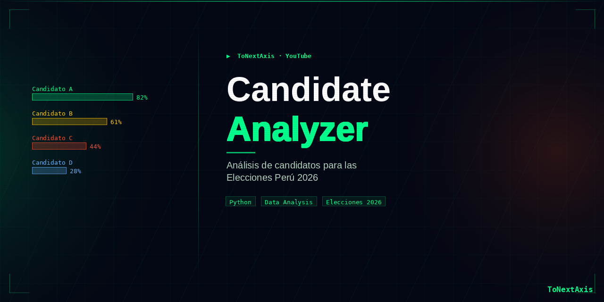
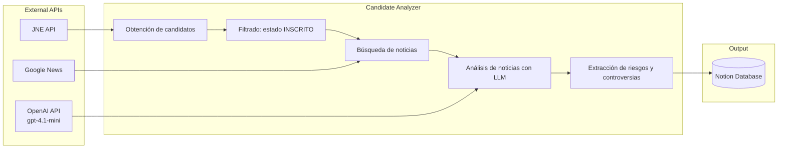

# Candidate Analyzer (Versión 1.0)
Sistema que analiza candidatos de elecciones peruanas 2026 utilizando noticias públicas y el LLM (**gpt-4.1-mini**) para identificar posibles riesgos o controversias.  
Los resultados se almacenan automáticamente en una base de datos de **Notion** para su análisis y visualización.

---
# Resultados de ejecución

- **2694 candidatos analizados**
- **Tiempo total:** 13,158.71 segundos (~3h 39m)
- **Tiempo promedio por candidato:** **4.88 segundos**

| Cargo Postulación | Cantidad | Tiempo (seg) |
|-------------------|----------|--------------|
| Presidente | 36 | 196.33 |
| 1er Vicepresidente | 36 | 205.49 |
| 2do Vicepresidente | 36 | 186.76 |
| Diputados | 1208 | 5817.53 |
| Senadores | 955 | 4678.47 |
| Parlamento Andino | 423 | 2074.13 |
| **Total** | **2694** | **13158.71** |

---
# Stack

- Python
- Google News
- OpenAI API (LLM: **gpt-4.1-mini**)
- Notion API
- JNE API

---
# Flujo del sistema

1. Se obtienen los candidatos desde el **API del JNE**.
2. Se filtran únicamente los candidatos con estado **INSCRITO**.
3. Se buscan noticias públicas relacionadas con cada candidato.
4. Un **LLM analiza las noticias** para identificar posibles problemas o riesgos.
5. Los resultados se almacenan automáticamente en **Notion**.

---
# Arquitectura del sistema



# Instalación

Clonar el repositorio:
```bash
git clone https://github.com/CarlosNaveda/Candidate_Analyzer.git
```

Instalar dependencias:
```bash
pip install -r requirements.txt
```

Configuración:
El proyecto utiliza variables de entorno para proteger las credenciales de acceso a los servicios externos.
Por ello, para ejecutar el proyecto debes crear un archivo .env en la raíz del proyecto con tus propias claves de API
```bash
OPENAI_API_KEY=tu_openai_api_key
NOTION_API_KEY=tu_notion_api_key
NOTION_DATABASE_ID=tu_notion_database_id
```
en tú .gitignore incluir
```bash
.env
```